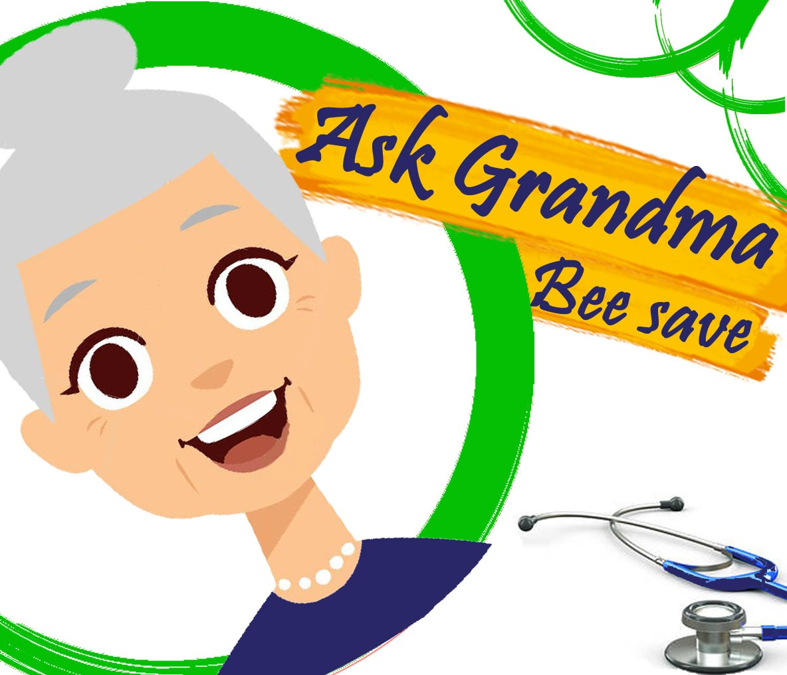

# Ask Grandma - bee safe
Die Idee des Alexa Skills „Ask Grandma – bee safe“ ist es, erste Hilfe bei kleinen Verletzungen im Alltag zu geben. Dabei wird zuerst abgeklärt, ob die Verletzung gefährlich ist. In diesem Fall wird der User in die Notaufnahme oder zu einem Arzt weitergeleitet, wobei ihm die nächsten Ärzte in der Umgebung aufgezählt werden. Andernfalls kann der User beruhigt werden, indem ihm zur Hilfe der Verletzung Omas Hausmittel vorgeschlagen werden. Für den Anfang werden die Verletzungen, die der Skill behandeln kann, auf Bienenstiche und Sonnenbrand eingeschränkt.

## Ressourcen:

- Hausmitteldatenbank
- Datenbank Notaufnahme/Spezialisten
- GPS/Standort

## Chancen/Risiken:

- großer Trend zur Beratung zuhause/online
- Entlastung von Notaufnahmen
- große Zielgruppe
- falsche Diagnose (Lösung: Weiterleitung an Arzt)

## Kommunikationsbeispiele:

### Verletzung mit Risiko

<b>Nutzer:</b> "Alexa, öffne bee safe"

<b>Alexa:</b> "Willkommen bei Ask Grandma! Hallo! Wie kann ich dir helfen?"

<b>Nutzer:</b> "Ich habe einen Sonnenbrand"

<b>Alexa:</b> "Oh, Siehst du Blasen an deinem Sonnenbrand oder hast du Kreislaufprobleme oder Fieber? Wenn nicht, kannst du mich nach Heilmitteln fragen.

<b>Nutzer:</b> "Ich habe Fieber"

<b>Alexa:</b> "Oh nein, dann hast du möglicherweise einen Sonnenstich und solltest zu einem Arzt gehen. Hier sind die nächsten Notaufnahmen: ..."

<b>Nutzer:</b> "stop"

<b>Alexa:</b> "Ich hoffe ich konnte dir helfen. Bis zum naechsten mal!"

### Verletzung die man mit Hausmitteln behandeln kann

<b>Nutzer:</b> "Alexa, öffne bee safe"

<b>Alexa:</b> "Willkommen bei Ask Grandma! Hallo! Wie kann ich dir helfen?"

<b>Nutzer:</b> "Ich habe einen Stich"

<b>Alexa:</b> "Oh nein! Falls der Stachel noch in der Haut steckt, zieh ihn sofort raus! Hast du schonmal allergisch auf Stiche reagiert oder wurdest du an einer gefährlichen Stelle gestochen? Ist der Stich angeschwollen oder hast du Atemnot? Wenn nicht, kannst du mich nach Heilmitteln fragen."

<b>Nutzer:</b> "Hausmittel"

<b>Alexa:</b> "Als Hausmittel fuer einen Bienenstich kannst du eine Zitrone, Zwiebel, Backpulver oder Venestil benutzen. Sage mir einfach welches du davon zur Hand hast und ich kann dir sagen wie du es anwendest."

<b>Nutzer:</b> "nein"

<b>Alexa:</b> "Das macht nichts. Lass etwas kaltes Wasser darueber laufen, dass hilft auch schon."

<b>Nutzer:</b> "stop"

<b>Alexa:</b> "Ich hoffe ich konnte dir helfen. Bis zum naechsten Mal!"

